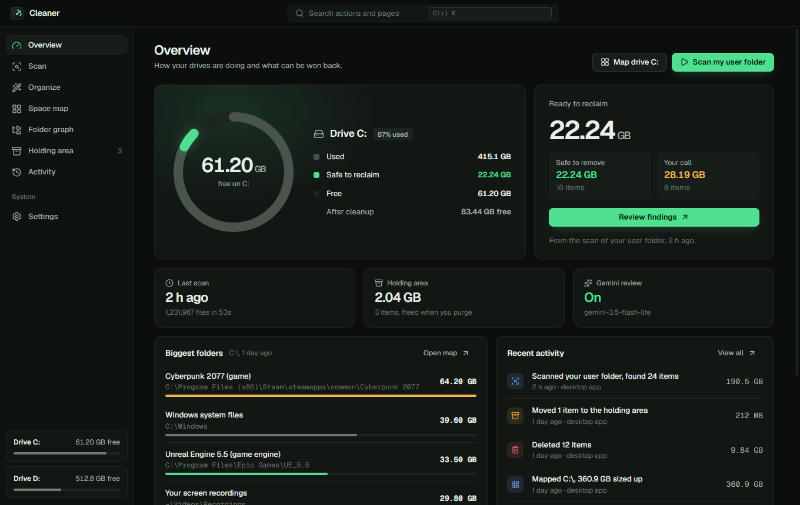
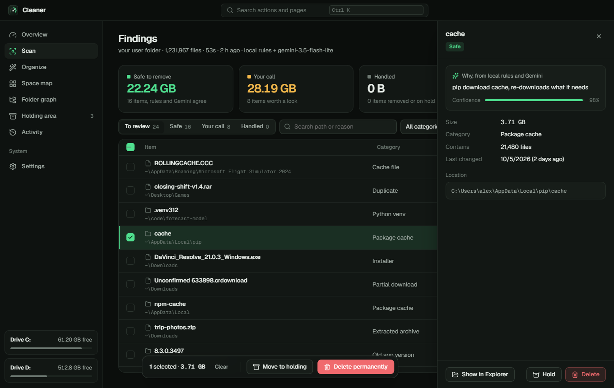
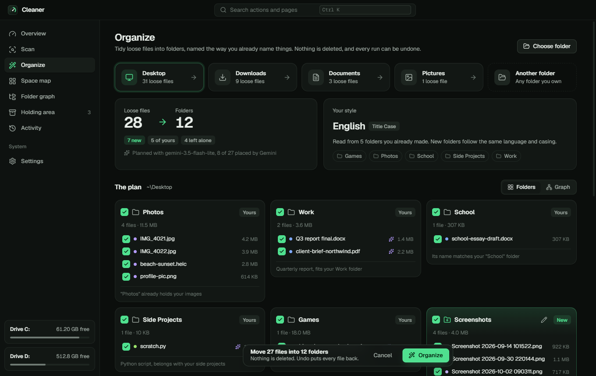
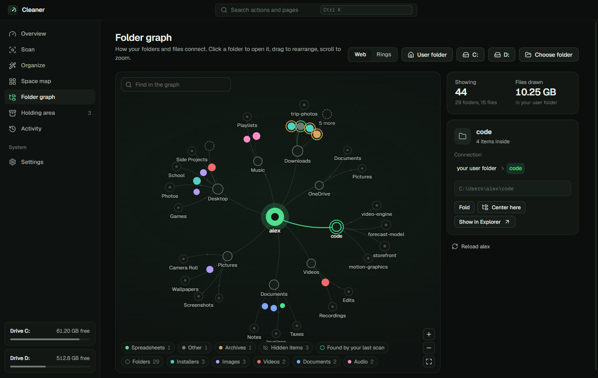
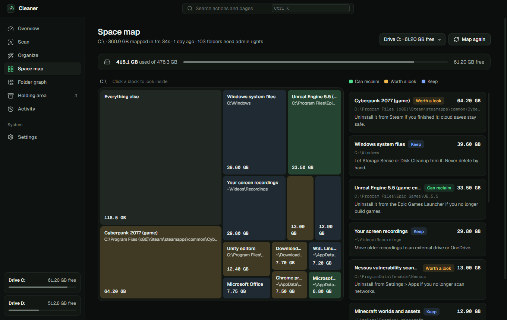
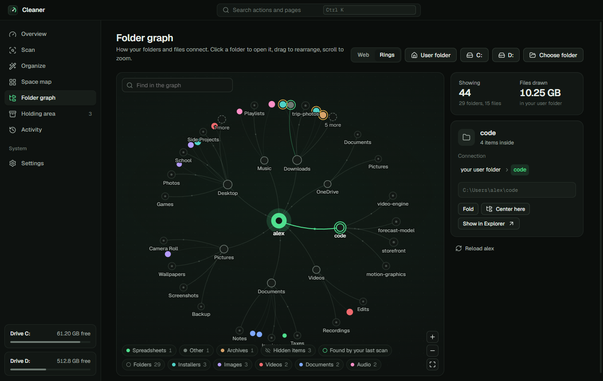
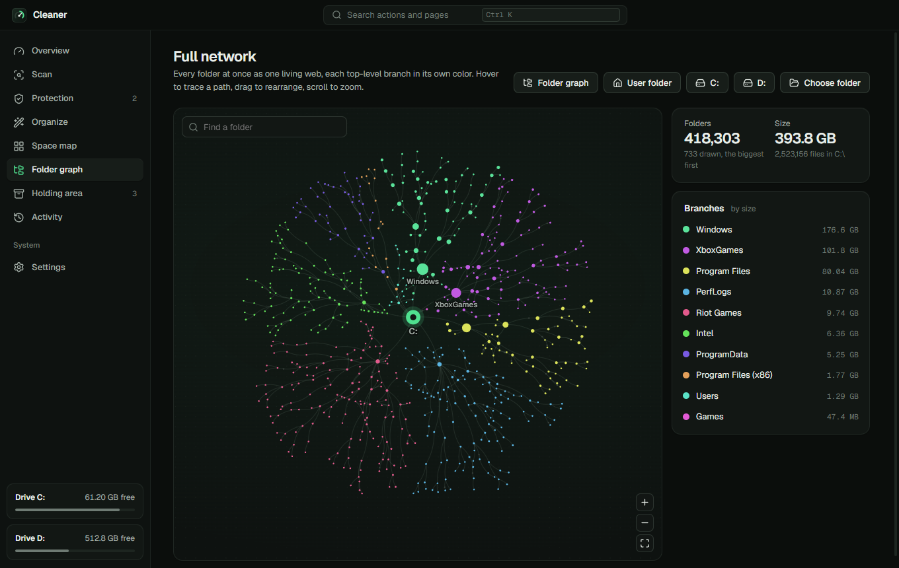
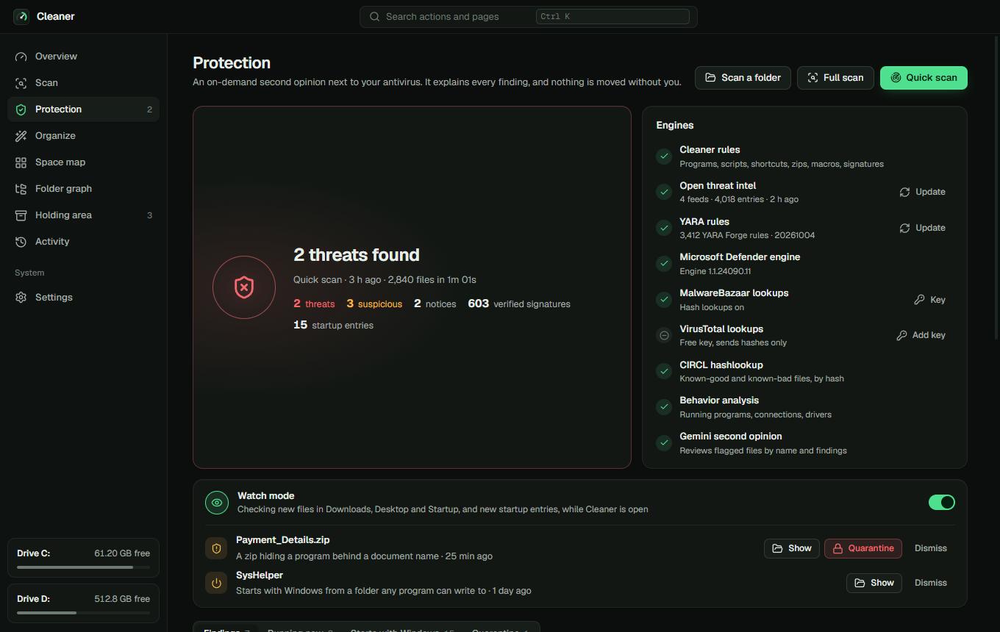
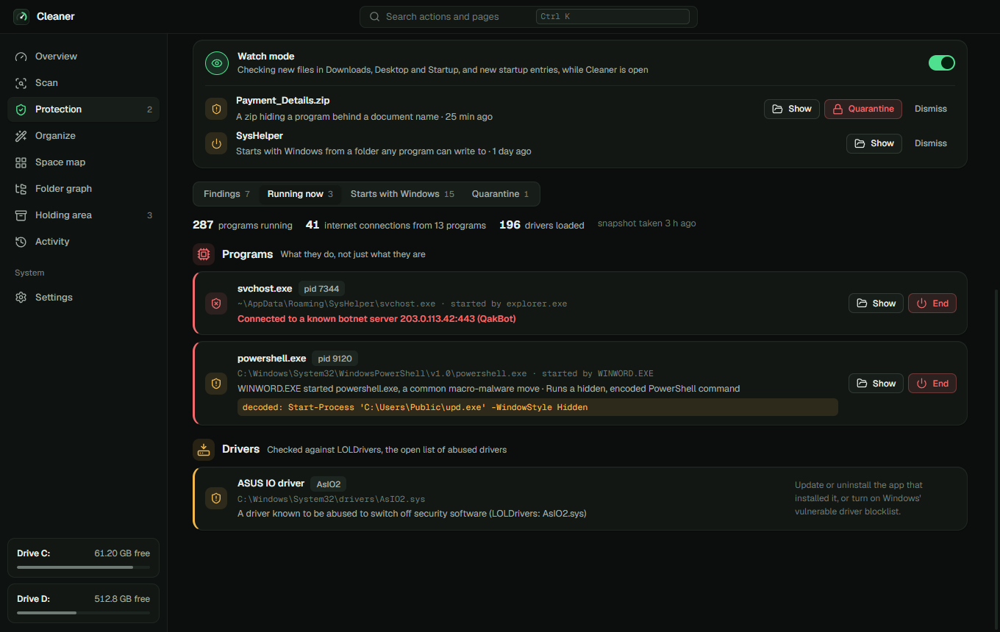

<p align="center">
  
</p>

<h1 align="center">Cleaner</h1>

<p align="center">
  Find the junk eating your Windows drive, tidy your folders the way you already name things,<br>
  and see how everything connects. Gemini double-checks, you decide.
</p>

<p align="center">
  <a href="https://github.com/WOOLMO/Cleaner/actions/workflows/ci.yml"></a>
  
  
  
  <a href="LICENSE"></a>
</p>

---

Cleaner comes as a **desktop app** and a **command line tool**. Both run the same engine, share the same data, and write to the same activity log.

- **Finds real junk.** Caches, unfinished downloads, crash dumps, temp files, `node_modules`, build output, old app versions, and byte-for-byte duplicates.
- **Gemini double-checks every candidate** on the free tier. It can veto a deletion, but it can never approve one on its own.
- **Organizes your folders in your own style.** It reads the folders you already made, their language and their casing, and files loose things the same way. No style yet? It uses plain folders in your Windows language.
- **Draws your folders as a living graph.** Folders spring open when you click them, links carry a flow from each folder to what it holds, and anything your last scan flagged lights up.
- **Scans for malware as a second opinion** next to your antivirus: open threat intel, YARA, signatures, behavior analysis and a watch mode, with every finding explained.
- **Maps your whole drive** and explains the biggest folders: what they are and the safe way to win the space back.
- **You decide, and you can undo.** Nothing is deleted or moved without your say. Held items and organize runs can be put back.

<table>
  <tr>
    <td width="50%"></td>
    <td width="50%"></td>
  </tr>
  <tr>
    <td><b>Findings.</b> Every item with the reason, Gemini's confidence, and one click to hold or delete it.</td>
    <td><b>Organize.</b> Your style, detected from your folders, and a preview of every move before anything happens.</td>
  </tr>
  <tr>
    <td></td>
    <td></td>
  </tr>
  <tr>
    <td><b>Folder graph.</b> How your folders and files connect. Drag, zoom, search, or switch to rings.</td>
    <td><b>Space map.</b> Where the space goes on the whole drive, explained in plain words.</td>
  </tr>
</table>

## Desktop app

Download `Cleaner-Setup-1.4.0.exe` (installer) or `Cleaner-1.4.0-win-x64.zip` (no install: unzip anywhere outside AppData and run `Cleaner.exe`) from [Releases](https://github.com/WOOLMO/Cleaner/releases/latest), or build them yourself:

```powershell
git clone https://github.com/WOOLMO/Cleaner
cd Cleaner\desktop
npm install
npm run dist        # release\1.4.0\Cleaner-Setup-1.4.0.exe and the zip
```

The builds are not code-signed yet, so Windows SmartScreen may ask you to confirm the first launch.

**Updates install themselves.** The installed app checks this repository's releases every few hours, downloads a new version in the background, checks it against the SHA-512 published with the release, and installs it when you close the app (or right away from Settings). The zip copy tells you when a new version is out. Turn checking off in Settings.

The first launch opens a short welcome that points to the four tools: Clean, Protect, Organize and Map.

| Page | What it does |
|---|---|
| **Overview** | Drive gauge, what is ready to reclaim, the biggest folders and recent activity |
| **Scan** | Pick folders, watch the scan phase by phase, then review findings in a fast table with filters and a detail drawer |
| **Protection** | Threat scans, what is running right now, everything that starts with Windows, watch mode and the quarantine |
| **Organize** | Tidy the loose files of your Desktop, Downloads or any folder you own, then undo with one click |
| **Space map** | A treemap of the drive; click any block to look inside |
| **Folder graph** | A living map of how folders and files connect, and the full network of every folder at once |
| **Holding area** | Items moved aside instead of deleted; restore or purge them |
| **Activity** | Every scan, hold, delete, restore and organize run, from the app and the command line, exportable to CSV |
| **Settings** | Gemini key, privacy switches, folders to never scan, theme, and your organization's policy |

`Ctrl+K` opens a command palette with every page and action. `Ctrl+1` to `Ctrl+9` jump between pages.

## Organize

Pick a folder and Cleaner plans where each loose file should go:

1. **It reads your style.** The names of the folders you already made tell it your language (English, French, Spanish, German, Italian, Portuguese, Dutch or Arabic), your casing (`Title Case`, `lower case`, `kebab-case`, `snake_case`...) and whether you number your folders (`01 - Work`).
2. **Your folders come first.** A file whose name matches one of your folders goes there (`facture-edf.pdf` into `Factures`), and a folder that already holds photos gets the new photos.
3. **New folders are named your way.** Anything left gets a folder named in your language and casing. With no folders to learn from, it uses plain names in your Windows language.
4. **Gemini can group by purpose** (invoices, a client, a school course) from file names, sizes and dates. It never sees file contents, and a bad suggestion falls back to the rules.
5. **You approve.** Untick files, rename new folders, then apply. Nothing is overwritten (a clash becomes `name (2).ext`), shortcuts and files in use are left alone, and code projects, system folders and app data are refused. **Undo** puts every file back and removes the folders it created.

From the command line:

```powershell
cleaner organize                 # your Desktop
cleaner organize D:\Downloads    # any folder you own
cleaner organize --dry-run       # show the plan, move nothing
cleaner organize --undo          # put the last run back
```

## Folder graph

A force-directed map of a folder: its subfolders and biggest files, coloured by kind. Click a folder and its contents spring out of it; click again and they fold back in. Hover anything to light up its path to the root, search to bring matches forward, and filter by kind from the legend. Items flagged by your last scan carry a green (safe) or amber (your call) ring, with a shortcut to the finding. Switch between the organic **Web** layout and concentric **Rings**. Hidden items such as dot-folders and AppData stay out of the way until you ask for them.

<p align="center">
  
</p>

**Full network** maps every folder of a drive or your user folder at once, in the same living web: the biggest 2,500 folders unfold outward from the root, each top-level branch in its own color, with the rest folded into "+N folders" nodes. It reuses the space map's walk, so a place you already mapped opens instantly.

<p align="center">
  
</p>

## Protection

A second opinion you run when you want, next to the antivirus that protects you in real time. It is not an antivirus replacement: blocking malware as it runs needs a kernel driver signed by Microsoft. What it does instead is look hard, explain everything, and never move a file without asking.

| Engine | What it checks |
|---|---|
| **Cleaner rules** | Reads Windows programs (imports, sections, entry point, packers, signatures), scripts, shortcuts, zips, Office macros and PDFs. Flags disguised and double extensions, process injection and keylogger imports, hidden encoded PowerShell (decoded and read), downloaders, stealer and ransom-note patterns. |
| **Open threat intel** | Feeds cached on your PC and refreshed daily: MalwareBazaar recent samples, URLhaus malware sites, Feodo Tracker botnet servers (abuse.ch), and LOLDrivers' list of malicious and abusable drivers. |
| **YARA** | VirusTotal's YARA engine with the YARA Forge core rules, installed from the app. Every download must match the checksum GitHub publishes for it. |
| **Microsoft Defender** | Its engine scans the risky files whenever Defender is your active antivirus. |
| **Hash lookups** | CIRCL hashlookup (known-good and known-bad files, no key), and MalwareBazaar and VirusTotal with free keys. Only SHA-256 fingerprints are sent. |
| **Behavior analysis** | What is running right now: fake system processes, Office starting PowerShell, encoded commands, programs running from temp folders, connections to known botnet servers, and loaded drivers checked against LOLDrivers. |
| **Startup audit** | Run keys, Startup folders, scheduled tasks, services, Winlogon, debugger hijacks and WMI consumers. |
| **Gemini** | An optional second opinion on flagged files, from names and findings only. |
| **Watch mode** | While Cleaner is open, new files in Downloads, Desktop and Startup are checked the moment they land, and new startup entries every ten minutes, with a Windows notification. |

Only hard evidence makes a file a **threat**: a known-bad hash, an antivirus engine, a strong hand-written YARA rule, a malware-site download or a botnet connection. The rules and Gemini can only make it **suspicious**, always with plain-language reasons. Machine-made YARA rules (yara-signator), which also match ordinary compiler code, only count as a weak sign, and a valid digital signature overrules a YARA-only verdict. A repeat scan reuses the fingerprints and signatures of files that have not changed, so it is much faster. Online-only OneDrive files are never opened, so a scan never downloads them. Quarantine scrambles a file so it can't run, and restores it exactly.

<table>
  <tr>
    <td width="50%"></td>
    <td width="50%"></td>
  </tr>
  <tr>
    <td><b>Protection.</b> The last scan, every engine, and watch mode alerts.</td>
    <td><b>Running now.</b> A botnet connection, Office starting hidden PowerShell (decoded), and an abusable driver.</td>
  </tr>
</table>

## Command line

```powershell
npm install -g github:WOOLMO/Cleaner
cleaner setup                  # optional: save a free Gemini key
cleaner scan                   # hunt junk in your user folder
cleaner scan D:\Downloads      # or in any folder
cleaner map                    # the biggest folders on C:, explained
cleaner organize               # tidy your Desktop, your way
cleaner protect                # threat scan: startup, downloads, temp, running programs
cleaner clean                  # pick items from the last scan by number
```

`cleaner setup` saves a free key from [aistudio.google.com/apikey](https://aistudio.google.com/apikey). Without a key, Cleaner runs on its local rules only. Needs Windows and Node.js 22 or newer.

When a scan finishes, cleaner asks one question:

- **`y`** deletes the safe items and shows how much space came back.
- **`n`** (or Enter) deletes nothing and writes `cleaner-remove.ps1` plus a double-clickable `cleaner-remove.bat` to your Desktop. Safe items are switched on; your-call items are written but commented out. The script lists everything and asks again before it deletes. Running it is your call.

<p align="center">
  
</p>

| Command | What it does |
|---|---|
| `cleaner scan [folders...]` | Find junk (default: your user folder), save the results, then ask `y/N` |
| `cleaner map [folder]` | Size the whole drive and explain the biggest folders (default: `C:\`) |
| `cleaner organize [folder]` | Tidy loose files into folders in your style (default: your Desktop) |
| `cleaner organize --undo` | Put the last organize run back |
| `cleaner protect [full\|folder]` | Threat scan, then choose what to quarantine (default: a quick scan) |
| `cleaner quarantine` | List quarantined files; `restore <n>` or `delete <n>` |
| `cleaner intel` | Refresh the open threat-intel feeds now |
| `cleaner yara install\|update` | Add YARA and the YARA Forge rules, or refresh the rules |
| `cleaner clean` | Pick items from the last scan: all safe ones, everything, or by number |
| `cleaner list` | Show the last scan |
| `cleaner export` | Write the removal script from the last scan |
| `cleaner restore` | Put held items back where they were |
| `cleaner purge` | Permanently delete held items |
| `cleaner setup` | Save or change your Gemini key |

| Option | What it does |
|---|---|
| `--hold` | Move items to the holding area instead of deleting (or set `CLEANER_HOLD=1`) |
| `--offline` | Local rules only, nothing is sent to Gemini |
| `--no-content` | Gemini gets names, sizes and dates, but no file previews |
| `--max-ai <n>` | Ask Gemini about at most n items, biggest first (default 400) |
| `--large <MB>` | Also ask about any file bigger than this (default 200) |
| `--top <n>` | How many folders `map` shows (default 15) |
| `--exclude <dir>` | Skip a folder (repeatable) |
| `--model <name>` | Try this Gemini model first |
| `--db <file>` | Use another database file |
| `--out <dir>` | Where the removal script goes (default: your Desktop) |
| `--dry-run` | With `clean` or `organize`: show the plan, change nothing |

## Safety

| Guarantee | How |
|---|---|
| Nothing is deleted without you | Every removal ends in a question you have to answer: `y/N` in the terminal, a confirmation in the app. |
| AI can't delete on its own | *Safe to remove* needs hard evidence from a local rule (a cache path, an unfinished download, a matching SHA-1) **and** Gemini agreeing. |
| Secrets are never flagged as junk | Files named or containing passwords, keys or tokens are always *your call*, and never get a preview. |
| System folders are off limits | `Windows`, `Program Files`, `ProgramData`, the Recycle Bin and `.git` folders are never touched. Drive roots and your home folder can't be removed. |
| Installed apps stay intact | Rebuildable folders (`node_modules`, `__pycache__`, `.venv`) only count in your own projects, never inside AppData or tool folders. Duplicates are never hunted inside a game, an app install or a project. |
| Organizing only moves | The organizer never deletes, never overwrites, only moves files that sit directly in the chosen folder, and records every move so the run can be undone. |
| Links can't trick it | Junctions and symlinks are never followed, so a link back up the tree can't cause a loop or a double count. |
| Undo when you want it | Holding moves items aside on the same drive; restore puts them back, purge frees the space. Organize runs undo with one click or `cleaner organize --undo`. |

The desktop window is locked down: no Node.js access, a strict content security policy, no navigation or pop-ups, and every request to the engine is validated. Files are acted on by their id from the last scan, never by a path the window hands over. The Gemini key is encrypted with Windows DPAPI.

## For organizations

Drop a policy file at `C:\ProgramData\Cleaner\policy.json` (with Intune, Group Policy or any deployment tool) and both the app and the command line follow it:

```json
{
  "organization": "Contoso IT",
  "aiEnabled": false,
  "allowPreviews": false,
  "allowPermanentDelete": false,
  "maxAiItems": 200,
  "excludePaths": ["C:\\Users\\*\\Documents\\Finance"]
}
```

Locked settings show as managed in the app. A policy file that can't be read fails closed: no Gemini, no previews, holding area only. Every action is appended to `%LOCALAPPDATA%\cleaner\audit.jsonl` with time, user, machine, item count and bytes, and the Activity page exports it to CSV.

## How it decides

1. **Local rules** walk your folders in parallel and collect candidates: unfinished downloads, temp and Office lock files, crash dumps, app caches, package caches (pip, npm, pnpm, Yarn, NuGet, Gradle, Go, Nuitka), `node_modules` next to a `package.json`, `__pycache__`, `.next` and other build output, Python virtual environments, older versions of self-updating apps, archives already extracted next to themselves, old installers in Downloads, and duplicate files confirmed by SHA-1. The rules know where they are: a folder with a `package.json`, `.git` or program files marks a project or app, and everything inside it is treated as part of it.
2. **Content check.** The first 4 KB of each candidate file reveal its real type: program, archive, photo, video, database. Small text files get a short preview with secrets masked.
3. **Gemini** reviews the candidates in batches of 40 and answers *remove*, *review* or *keep*, with a one-line reason. Flash-Lite goes first because it has the most generous free limits; busy or rate-limited models fall back to the next one.
4. **The verdict** combines both. Only items where a rule and Gemini agree become *safe*; Gemini on its own can only suggest *your call*.

Results go to a tab-separated database, `%LOCALAPPDATA%\cleaner\cleaner-db.txt`, that opens in Notepad or Excel. Change an item's status to `keep` and Cleaner leaves it alone.

## Privacy

With Gemini on, a scan sends file paths, sizes, dates, detected file types and short masked previews of small text files. The space map sends only folder names and sizes. The organizer sends file names, sizes and dates, and the names of your folders. The folder graph sends nothing. The threat scan downloads public threat-intel lists (nothing about your PC is sent) and sends only SHA-256 fingerprints of flagged files to CIRCL hashlookup, and to MalwareBazaar and VirusTotal if you add keys. Turning Gemini off in Settings keeps the threat scan fully offline too. On the free tier, Google may use that data to improve its products. Turn previews off, or Gemini off entirely, in Settings or with `--no-content` and `--offline`.

## Development

```powershell
git clone https://github.com/WOOLMO/Cleaner
cd Cleaner
npm test                          # engine tests, never call Google
node bin/cleaner.js scan --offline

cd desktop
npm install
npm run dev                       # the app with hot reload
npm run typecheck
npm run e2e                       # drives the real app: demo data and an empty real profile
npm start -- --demo               # the app on built-in sample data, touches nothing
```

The engine tests build a fake user folder full of traps (junction loops, `.git` folders, global npm tools, names with apostrophes and emoji, duplicates in Backup folders) and throwaway folders to organize and undo. The end-to-end tests launch the built Electron app with Playwright, click through every page, and boot it once on a throwaway real profile to check the bridge, the settings and that the window cannot reach Node.js. The screenshots in this README come from demo mode, which runs on made-up sample data.

**Releasing.** Bump the version in `desktop/package.json` and `package.json`, update `desktop/build/release-notes.md`, then push a tag such as `v1.4.0`. GitHub Actions runs every test, builds the installer and zip, and publishes the release that installed apps update from.

## License

[MIT](LICENSE)
