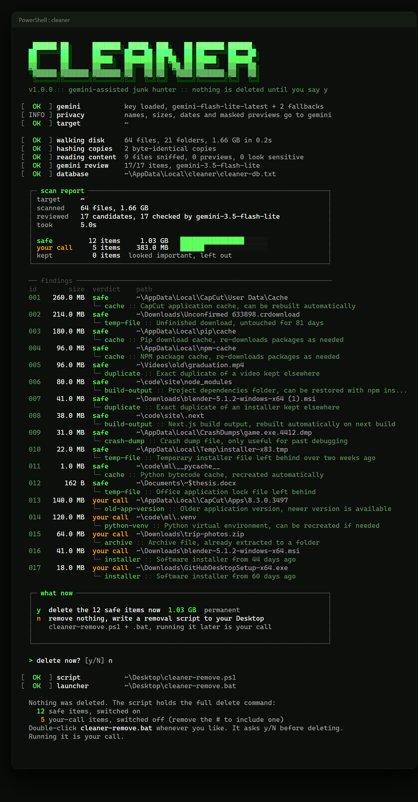
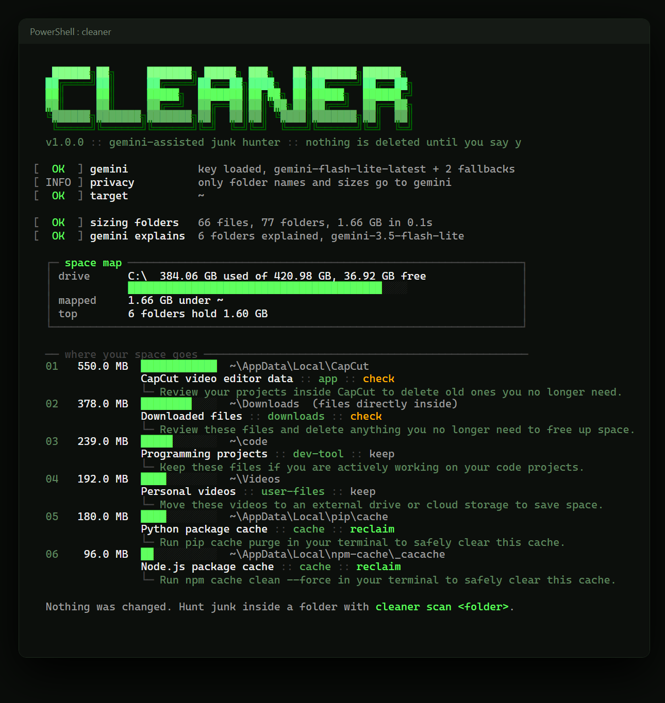

<p align="center">
  
</p>

<h1 align="center">cleaner</h1>

<p align="center">
  Find the junk eating your Windows drive, let Gemini double-check it, and delete only what you approve.
</p>

<p align="center">
  <a href="https://github.com/WOOLMO/Cleaner/actions/workflows/ci.yml"></a>
  
  
  
  <a href="LICENSE"></a>
</p>

---

- **Finds real junk.** Caches, unfinished downloads, crash dumps, temp files, `node_modules`, build output, old app versions, and byte-for-byte duplicates.
- **Looks inside files** to tell what they really are. Secrets, tokens and emails are masked before anything leaves your PC.
- **Gemini double-checks every candidate** on the free tier. It can veto a deletion, but it can never approve one on its own.
- **Maps your whole drive** and explains the biggest folders: what they are and the safe way to win the space back.
- **You decide.** Press `y` to delete, use `--hold` to move things aside where you can undo it, or take a ready-made removal script.
- **Fast and light.** Zero dependencies, and a parallel disk walk that is about 5x faster than a one-folder-at-a-time scan.

## Install

```powershell
npm install -g github:WOOLMO/Cleaner
cleaner setup
```

`cleaner setup` saves a free Gemini key from [aistudio.google.com/apikey](https://aistudio.google.com/apikey). It is optional: without a key, cleaner runs on its local rules only. Needs Windows and Node.js 22 or newer.

## Use

```powershell
cleaner scan                   # hunt junk in your user folder
cleaner scan D:\Downloads      # or in any folder
cleaner map                    # the biggest folders on C:, explained
cleaner clean                  # pick items from the last scan by number
```

When a scan finishes, cleaner asks one question:

- **`y`** deletes the safe items and shows how much space came back.
- **`n`** (or Enter) deletes nothing and writes `cleaner-remove.ps1` plus a double-clickable `cleaner-remove.bat` to your Desktop. Safe items are switched on; your-call items are written but commented out. The script lists everything and asks again before it deletes. Running it is your call.

<p align="center">
  
</p>

## Safety

| Guarantee | How |
|---|---|
| Nothing is deleted without you | Every removal path ends in a `y/N` question you have to answer. |
| AI can't delete on its own | *Safe to remove* needs hard evidence from a local rule (a cache path, an unfinished download, a matching SHA-1) **and** Gemini agreeing. |
| Secrets are never flagged as junk | Files named or containing passwords, keys or tokens are always *your call*, and never get a preview. |
| System folders are off limits | `Windows`, `Program Files`, `ProgramData`, the Recycle Bin and `.git` folders are never touched. Drive roots and your home folder can't be removed. |
| Installed apps stay intact | Rebuildable folders (`node_modules`, `__pycache__`, `.venv`) only count in your own projects, never inside AppData or tool folders like `.vscode`. Duplicates are never hunted inside a game, an app install or a project, so a second copy of a game or a shared logo can't break anything. |
| Links can't trick it | Junctions and symlinks are never followed, so a link back up the tree can't cause a loop or a double count. |
| Undo when you want it | `--hold` moves items into a holding area on the same drive. `cleaner restore` puts them back, `cleaner purge` frees the space. |

## Commands

| Command | What it does |
|---|---|
| `cleaner scan [folders...]` | Find junk (default: your user folder), save the results, then ask `y/N` |
| `cleaner map [folder]` | Size the whole drive and explain the biggest folders (default: `C:\`) |
| `cleaner clean` | Pick items from the last scan: all safe ones, everything, or by number |
| `cleaner list` | Show the last scan |
| `cleaner export` | Write the removal script from the last scan |
| `cleaner restore` | Put held items back where they were |
| `cleaner purge` | Permanently delete held items |
| `cleaner setup` | Save or change your Gemini key |

| Option | What it does |
|---|---|
| `--hold` | Move items to the holding area instead of deleting (or set `CLEANER_HOLD=1`) |
| `--offline` | Local rules only, nothing is sent to Gemini |
| `--no-content` | Gemini gets names, sizes and dates, but no file previews |
| `--max-ai <n>` | Ask Gemini about at most n items, biggest first (default 400) |
| `--large <MB>` | Also ask about any file bigger than this (default 200) |
| `--top <n>` | How many folders `map` shows (default 15) |
| `--exclude <dir>` | Skip a folder (repeatable) |
| `--model <name>` | Try this Gemini model first |
| `--db <file>` | Use another database file |
| `--out <dir>` | Where the removal script goes (default: your Desktop) |
| `--dry-run` | With `clean`: list, don't remove |

## How it decides

1. **Local rules** walk your folders in parallel and collect candidates: unfinished downloads (`.crdownload` anywhere, `.part` where downloads land), temp and Office lock files, crash dumps, app caches, package caches (pip, npm, pnpm, Yarn, NuGet, Gradle, Go, Nuitka), `node_modules` next to a `package.json`, `__pycache__`, `.next` and other build output, Python virtual environments, older versions of self-updating apps, archives already extracted next to themselves, old installers in Downloads, and duplicate files confirmed by SHA-1. The rules know where they are: a folder with a `package.json`, `.git` or program files marks a project or app, and everything inside it is treated as part of it.
2. **Content check.** The first 4 KB of each candidate file reveal its real type: program, archive, photo, video, database. Small text files get a short preview with secrets masked.
3. **Gemini** reviews the candidates in batches of 40 and answers *remove*, *review* or *keep*, with a one-line reason. Flash-Lite goes first because it has the most generous free limits; busy or rate-limited models fall back to the next one.
4. **The verdict** combines both. Only items where a rule and Gemini agree become *safe*; Gemini on its own can only suggest *your call*.

Results go to a tab-separated database, `%LOCALAPPDATA%\cleaner\cleaner-db.txt`, that opens in Notepad or Excel. Change an item's status to `keep` and cleaner leaves it alone.

## Privacy

With Gemini on, a scan sends file paths, sizes, dates, detected file types and short masked previews of small text files. `map` sends only folder names and sizes. On the free tier, Google may use that data to improve its products. Use `--no-content` to send no previews, or `--offline` to send nothing at all.

## Development

```powershell
git clone https://github.com/WOOLMO/Cleaner
cd Cleaner
npm test
node bin/cleaner.js scan --offline
```

The tests build a fake user folder full of traps (junction loops, `.git` folders, global npm tools, names with apostrophes and emoji, duplicates in Backup folders) and never call Google.

## License

[MIT](LICENSE)
